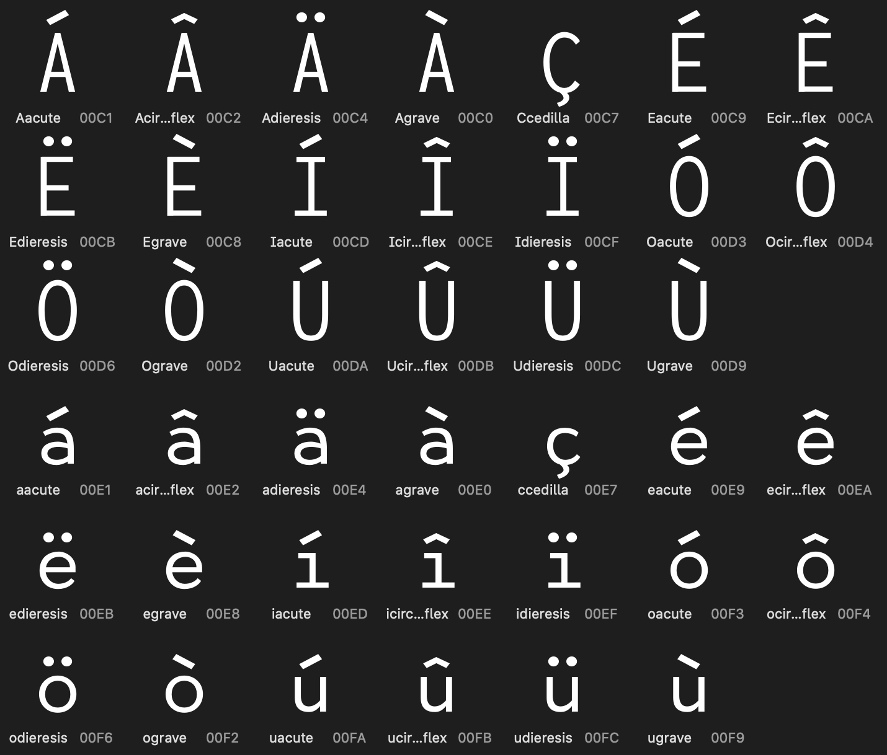

# Lotion
A cute free font for programming!

## Features
- Weights: Regular, SemiBold, Bold, Black
- Styles: Roman & *Italics*
- Now available as a variable font!

## Update: more western european language support

## Credits
Ligatures by @Nicell. Thank you!
